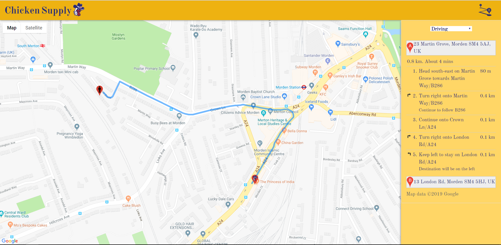

  

Chicken Supply is a web app built with the Google Maps API which allows users to find the nearest chicken shop based on their location. Shop information is based on data from the Food Standards Agency. Currently only covers chicken shops in Merton, although I plan to expand this in the future.

## Getting Started

Simply travel to the webpage located at zachmolony.github.io/howfartodallas/ and click to allow your location.

## Context 

I chose option three of the assigned projects, to create a map with the Google Maps API which allowed the user to travel to a fixed location. When I first started this project, I met the requirements and then felt that the app could have a lot of potential if it worked with all chicken shops in London, rather than just one. 

To implement this, I downloaded the data from the Food Standards Agency, which was an XML document which contained lots of information about every single eatery in my borough, including its name and their geographical coordinates. This was perfect for me to implement into my map, which already worked for one location. 

What I then did was convert the file to JSON, and then searched the file with an xhttp request in my main.js file, and found all nodes which had the string "Chicken" or "Peri" in their title. Obviously an expansion of the program to larger data sets would require this to have a more rigourous search but for now the prototype will stand. 

## Built With

- Bootstrap 4
- W3CSS
- jQuery 
- AJAX

## Design 

See my [Design Document](docs/design.md)

## Limitations

There are some flaws with this current implementation which need addressing and which need to be changed in a London-wide implementation. The files I am reading from take far too long to query due to their size, which although does not inhibit the program, will not be suitable if I introduce another 32 data sets of similar size. 

In the future I will need to write a script which can read all these files and extract the relevant data and write it to another file which the program can use, making it faster to process. This has not occured yet due to my current limited knowledge of XML manipulation, however this is something I am currently working towards. 

With this, however, the issue becomes how the data will be maintained and updated. This will not be a huge issue as the data is only updated annually or so, though a solution lies in an API from The Food Standards Agency, allowing XML requests directly to their server. This would still suffer from the same if not potentially worse latency issues, and my lack of knowlege of the technology and lack of documentation available. 

