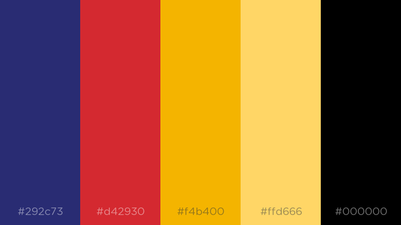

# Design documentation 

## Concept 

I chose to have my route to my favourite chicken shop, as I am good friends with the owner and have been a long time fan of the quality food. I build this app to share my love of Dallas and make it easy as possible for everyone to find good quality chicken.

## Design

### Visual design

I decided to use a combination of the Google colour scheme, and colours from the Dallas Chicken and Ribs logo. I am using the Google Yellow, and red and blue from Dallas. I am using bootstrap to enhance my front end, and will be including jQuery animations to make the app look more polished.

#### Layout and Flow design

I decided to create some wireframes to map out the layout and general design of the site. I created a main layout and an alternative layout and mapped the flow of the program.

##### Layout 1

##### Layout 2

I decided on the first layout as it was more visually attractive.

### Icons

I created some custom markers to make the map more visually exciting.

**User Marker** 

**Dallas Chicken Marker** 

I am using this icon "directions" made by Gabor Fulop, sourced from the Noun Project.

#### Error messages

I will be using modals from Bootstrap to deliver error messages, which will handle the following errors:

- *"Sorry, we can't seem to find a way to Dallas Chicken."*
- *"Please allow Chicken Supply to know your location."*
- *"Geolocation is not suppourted by your browser."*

##### Example

